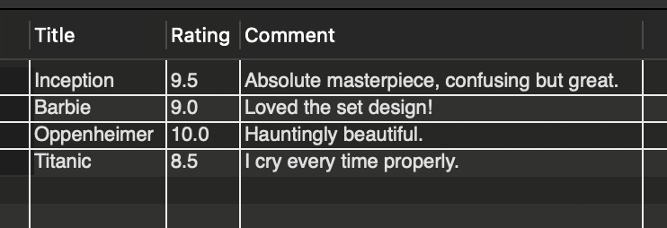

# 🎬 Movie Management System


## 📌 Project Overview
The **Movie Management System** is a relational database designed to manage the data requirements of a movie database application. It handles complex relationships between **Movies**, **Actors**, **Directors**, and **User Reviews**.

This project demonstrates core DBMS concepts including:
- **Normalization** (3NF)
- **Many-to-Many Relationships** (via Junction Tables)
- **Complex JOIN operations**
- **Data Integrity constraints** (Primary & Foreign Keys)

---

## 📸 Database Schema (ER Diagram)
Below is the Entity-Relationship (ER) Diagram representing the logical structure of the database:


*(Note: This diagram illustrates the One-to-Many and Many-to-Many relationships implemented in the schema)*

---

## 💻 Project Outputs
Here are the results of the complex queries running in MySQL Workbench:

### 1. Query Execution Results


### 2. Table Data & Formatting


---

## 🛠️ Tech Stack
- **Database:** MySQL
- **Design Tool:** MySQL Workbench (for ER Modeling)
- **Version Control:** Git & GitHub

---

## 🚀 Key Features & Logic

### 1. The Junction Table (`Movie_Cast`)
To handle the **Many-to-Many** relationship between Actors and Movies (since one actor is in many movies, and one movie has many actors), I implemented a junction table `Movie_Cast`.

```sql
CREATE TABLE Movie_Cast (
    MovieID INT,
    ActorID INT,
    RoleName VARCHAR(100),
    PRIMARY KEY (MovieID, ActorID), -- Composite Key
    FOREIGN KEY (MovieID) REFERENCES Movies(MovieID),
    FOREIGN KEY (ActorID) REFERENCES Actors(ActorID)
);
SELECT m.Title, a.FirstName, a.LastName, mc.RoleName
FROM Movies m
JOIN Movie_Cast mc ON m.MovieID = mc.MovieID
JOIN Actors a ON mc.ActorID = a.ActorID
WHERE m.Title = 'Oppenheimer';

SELECT m.Title, r.Rating
FROM Movies m
JOIN Directors d ON m.DirectorID = d.DirectorID
JOIN Reviews r ON m.MovieID = r.MovieID
WHERE d.LastName = 'Nolan'
ORDER BY r.Rating DESC
LIMIT 1;

